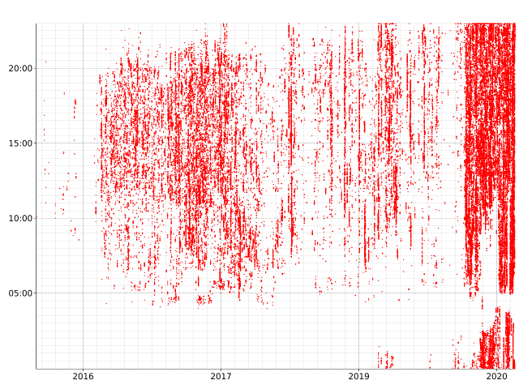

# discplot - plot your discord message history

## usage
- get a discord GDPR data dump 
- build it with the rust tools (`cargo build`)
- run this to stream all the messages into the program: `grep -hv 'ID,Timestamp' /path/to/messages/folder/*/messages.csv | /path/to/discplot/binary`

## inspiration
[this twitter thread](https://twitter.com/lunasorcery/status/1334519572330909696) that was posted [here](https://lobste.rs/s/hboeju/decade_irc_usage_visualized)